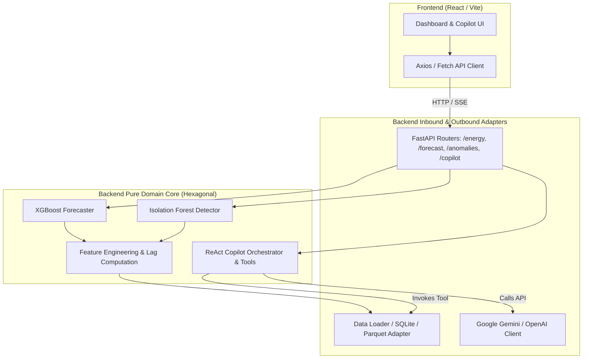
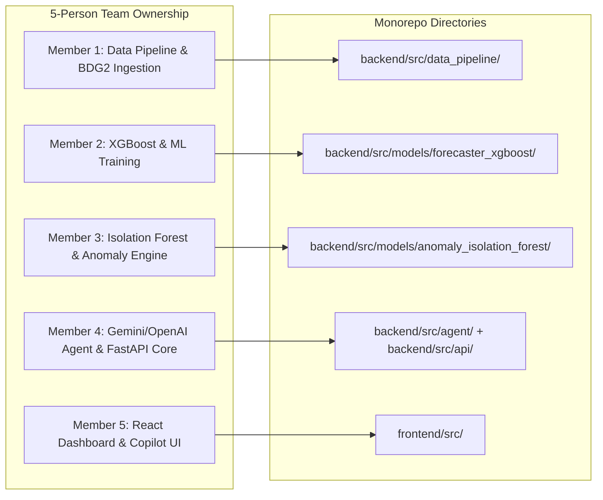

# Architecture Spine — EcoTrack

## Design Paradigm

EcoTrack adopts a **Decoupled Monorepo** architecture structured into two primary domains:

1. **Backend (Hexagonal / Ports & Adapters)**:
   - **Core Domain (Pure Python)**: Machine Learning algorithms (`models/`), Data transformation pipelines (`data_pipeline/`), and LLM Agent Tools (`agent/tools/`). The Core contains zero knowledge of HTTP, web frameworks, or databases.
   - **Ports**: Abstract interfaces for telemetry repositories, model inference wrappers, and LLM providers.
   - **Adapters (FastAPI / SQLite / Cloud APIs)**: Implementations that connect the outside world (HTTP requests, CSV/Parquet files, Google Gemini / OpenAI APIs) to the domain core.
2. **Frontend (Component-Driven React SPA)**:
   - Modular hierarchy with clear separation between **Data Fetching & Cache** (`services/` + custom hooks), **Presentation Components** (`components/dashboard/`), and **Conversational Copilot Drawer** (`components/copilot/`).



---

## Invariants & Rules

### AD-1 — Strict Hexagonal Boundary for ML & Agent Logic `[ADOPTED]`
- **Binds:** `backend/src/models/`, `backend/src/agent/`, `backend/src/data_pipeline/`
- **Prevents:** Web framework coupling; prevents `fastapi`, `Request`, or `Response` objects from leaking into ML training scripts or mathematical utilities.
- **Rule:** Modules inside `src/models/`, `src/agent/tools/`, and `src/data_pipeline/` MUST be callable as standalone pure Python libraries without starting a FastAPI instance or passing web request objects.

### AD-2 — Non-blocking Asynchronous Machine Learning Inference `[ADOPTED]`
- **Binds:** `backend/src/api/routers/forecast.py`, `backend/src/api/routers/anomalies.py`
- **Prevents:** Event loop starvation; CPU-bound XGBoost matrix operations and Isolation Forest tree evaluations blocking concurrent HTTP requests.
- **Rule:** Any CPU-intensive inference or batch lag calculation in FastAPI route handlers MUST execute within `asyncio.to_thread` or a `concurrent.futures.ThreadPoolExecutor`. Route handlers are declared `async def` and await thread execution.

### AD-3 — Stateless LLM Agent with Tool Injection (No Raw Telemetry Flooding) `[ADOPTED]`
- **Binds:** `backend/src/agent/orchestrator.py`, `backend/src/agent/tools/`
- **Prevents:** Context window exhaustion, hallucinated statistical metrics, and exorbitant API token costs.
- **Rule:** The Agent prompt MUST NEVER be injected with raw continuous telemetry time-series. The LLM Agent MUST interact strictly through structured Function Calling / Tools (`query_metrics`, `get_anomalies`, `query_forecast`, `calculate_waste_cost`), passing query arguments and receiving compact, pre-aggregated statistical summaries.

### AD-4 — Decoupled State Management in React Frontend `[ADOPTED]`
- **Binds:** `frontend/src/`
- **Prevents:** Cascading re-renders; UI chart redraws freezing the conversational chat input during streaming tokens.
- **Rule:** Time-series telemetry data and Copilot chat conversation state MUST maintain isolated state lifecycles. Copilot streaming messages update only the `CopilotDrawer` component tree, leaving the Recharts / ECharts SVG canvas untouched.

### AD-5 — Unified Time-Series Data Contract (ISO 8601 UTC & Float kWh) `[ADOPTED]`
- **Binds:** `backend/src/api/schemas/`, `frontend/src/services/api.js`
- **Prevents:** Timezone offset misalignment between building local time and server timestamps; type mismatches between pandas float64 and Javascript numbers.
- **Rule:** All timestamps transmitted across API boundaries MUST be formatted in ISO 8601 UTC (`YYYY-MM-DDTHH:mm:ssZ`). Energy values MUST be serialized as floating-point numbers representing kilowatt-hours (`kWh`) or kilowatts (`kW`).

### AD-6 — 5-Person Team Monorepo Ownership & Dockerized Reproducibility `[ADOPTED]`
- **Binds:** All developers, `docker-compose.yml`, Git workflow
- **Prevents:** Merge conflicts across disciplines (Data Science vs. Web Frontend); "it works on my machine" setup discrepancies.
- **Rule:** The repository maintains separated top-level `backend/` and `frontend/` roots. Every PR impacting core APIs must validate against `docker-compose up --build`.



---

## Consistency Conventions

| Concern | Convention |
| :--- | :--- |
| **Python Naming** | Snake_case for functions/variables (`calculate_mape`, `meter_reading`); PascalCase for classes (`EnergyForecaster`, `IsolationDetector`); ALL_CAPS for constants. |
| **React Naming** | PascalCase for components (`ForecastChart.jsx`, `CopilotDrawer.jsx`); camelCase for hooks and utilities (`useEnergyData.js`, `apiClient.js`). |
| **API Endpoints** | Kebab-case plural resources under `/api/v1/`: `/api/v1/energy/timeseries`, `/api/v1/anomalies/events`, `/api/v1/copilot/chat`. |
| **Error Handling** | Standardized FastAPI error envelope: `{"detail": "Error description", "code": "ERR_MODEL_NOT_FOUND"}` with proper HTTP status codes (400, 404, 422, 500). |
| **Configuration** | Pydantic `BaseSettings` reading from `.env` with fallback to `configs/*.yaml`. No hardcoded credentials. |

---

## Stack (Verified Pinned Versions)

| Component | Technology | Version | Rationale |
| :--- | :--- | :--- | :--- |
| **Backend Runtime** | Python | `^3.11` | Optimized performance for scientific ML libraries |
| **Web Framework** | FastAPI | `^0.115.0` | High-throughput asynchronous REST API & OpenAPI docs |
| **Server ASGI** | Uvicorn | `^0.30.0` | Production-grade ASGI web server |
| **Forecasting Model** | XGBoost | `^2.1.0` | State-of-the-art gradient boosted trees for time-series |
| **Anomaly Detection** | Scikit-learn | `^1.5.0` | Robust, standardized `IsolationForest` implementation |
| **Data Processing** | Pandas / Numpy | `^2.2.0` | High-efficiency vectorized time-series manipulation |
| **Cloud LLM SDK** | Google GenAI / OpenAI | `^0.8.0` / `^1.40.0` | Native JSON schema function calling and SSE streaming |
| **Frontend Framework** | React + Vite | `^18.3.0` | Fast HMR developer experience, modern React ecosystem |
| **Styling** | TailwindCSS | `^3.4.0` | Utility-first responsive design tokens |
| **Charts** | Recharts / Lucide Icons | `^2.12.0` | Declarative SVG charting with smooth transition animations |
| **Containerization** | Docker Compose | `^2.24.0` | Zero-friction local spin-up for the 5-person team |

---

## Structural Seed (5-Person Team Workspace Layout)

```text
EcoTrack/
├── docker-compose.yml                  # Khởi chạy fullstack (backend:8000, frontend:3000)
├── .gitignore                          # Đã cấu hình ignore file nặng, cache, .env
├── README.md                           # Onboarding tài liệu dự án
│
├── _bmad-output/                       # BMad Planning & Architecture Artifacts
│   └── planning-artifacts/
│       ├── prds/prd-EcoTrack-2026-09-23/
│       │   ├── prd.md
│       │   ├── addendum.md
│       │   └── .memlog.md
│       └── architecture/architecture-EcoTrack-2026-09-23/
│           ├── ARCHITECTURE-SPINE.md   # Tài liệu này
│           └── .memlog.md
│
├── backend/                            # Domain Backend & AI/ML (Thành viên 1, 2, 3, 4)
│   ├── Dockerfile                      # Python 3.11 slim image
│   ├── requirements.txt                # Pinned pip dependencies
│   ├── .env.example                    # Sample keys: GEMINI_API_KEY, TARIFF_RATE
│   ├── configs/
│   │   ├── base_config.yaml            # Port, host, database path
│   │   ├── model_config.yaml           # Hyperparameters (XGBoost, Isolation Forest)
│   │   └── agent_config.yaml           # LLM system prompts & tool definitions
│   ├── data/
│   │   ├── raw/                        # Chứa dữ liệu mẫu Building Data Genome 2
│   │   └── processed/                  # Cached parquet files
│   └── src/
│       ├── __init__.py
│       ├── main.py                     # Entrypoint: FastAPI app, CORS, router mounting
│       │
│       ├── data_pipeline/              # [Phụ trách: Thành viên 1]
│       │   ├── __init__.py
│       │   ├── bdg2_loader.py          # Parser đọc dataset BDG2/ASHRAE
│       │   ├── preprocessor.py         # Resample, clean missing, add calendar flags
│       │   └── feature_engineering.py  # Lag features (t-1, t-24, t-168), rolling stats
│       │
│       ├── models/
│       │   ├── __init__.py
│       │   ├── forecaster_xgboost/     # [Phụ trách: Thành viên 2]
│       │   │   ├── __init__.py
│       │   │   ├── trainer.py          # Training pipeline & TimeSeriesSplit CV
│       │   │   └── predictor.py        # 24h horizon inference + 95% confidence band
│       │   │
│       │   ├── anomaly_isolation_forest/ # [Phụ trách: Thành viên 3]
│       │   │   ├── __init__.py
│       │   │   ├── detector.py         # Isolation Forest model wrapper
│       │   │   └── thresholding.py     # Severity classification (Low, Medium, Critical)
│       │   │
│       │   └── artifacts/              # Checkpoint models (.joblib)
│       │
│       ├── agent/                      # [Phụ trách: Thành viên 4]
│       │   ├── __init__.py
│       │   ├── orchestrator.py         # ReAct loop calling Google Gemini / OpenAI
│       │   ├── prompts.py              # Energy diagnostics expert prompt
│       │   └── tools/                  # Function calling definitions
│       │       ├── __init__.py
│       │       ├── query_metrics.py    # Tool: lấy chỉ số kWh và thống kê
│       │       ├── get_anomalies.py    # Tool: lấy danh sách cảnh báo bất thường
│       │       ├── query_forecast.py   # Tool: lấy kết quả dự báo
│       │       └── calculate_cost.py   # Tool: tính toán tiền lãng phí
│       │
│       └── api/                        # [Phụ trách: Thành viên 4]
│           ├── __init__.py
│           ├── routers/
│           │   ├── energy.py           # GET /api/v1/energy/timeseries
│           │   ├── forecast.py         # GET /api/v1/forecast/predict
│           │   ├── anomalies.py        # GET /api/v1/anomalies/events
│           │   └── copilot.py          # POST /api/v1/copilot/chat (Streaming SSE)
│           └── schemas/
│               ├── energy.py           # Telemetry schemas
│               ├── forecast.py         # Forecast response schemas
│               ├── anomalies.py        # Anomaly response schemas
│               └── copilot.py          # Chat request & response schemas
│
└── frontend/                           # Domain Web Client (Thành viên 5)
    ├── Dockerfile                      # Node 20 alpine + Nginx production stage
    ├── package.json
    ├── vite.config.js
    ├── tailwind.config.js
    ├── index.html
    └── src/
        ├── main.jsx
        ├── App.jsx                     # Core application layout
        ├── index.css                   # Tailwind directives
        ├── services/
        │   └── api.js                  # Axios client với baseURL từ VITE_API_URL
        ├── hooks/
        │   ├── useEnergyData.js        # Data fetching & caching hook
        │   └── useCopilot.js           # Chat history & SSE streaming parser hook
        └── components/
            ├── layout/
            │   ├── Header.jsx          # Thanh công cụ, chọn tòa nhà, chọn ngày
            │   └── Sidebar.jsx
            ├── dashboard/
            │   ├── MetricCards.jsx     # Tổng kWh, Đỉnh phụ tải, Điểm bất thường
            │   ├── ForecastChart.jsx   # Biểu đồ Recharts: Actual vs Predicted + 95%
            │   └── AnomalyTable.jsx    # Bảng danh sách cảnh báo kèm nút Hỏi Copilot
            └── copilot/
                ├── CopilotDrawer.jsx   # Slide-over chat panel
                ├── ChatMessage.jsx     # Markdown renderer + Tool call badge
                └── QuickPrompts.jsx    # Gợi ý câu hỏi nhanh
```

---

## Capability → Architecture Map

| Capability (from PRD) | Lives in | Governed by |
| :--- | :--- | :--- |
| **FR-1**: BDG2/ASHRAE Ingestion | `backend/src/data_pipeline/bdg2_loader.py` | AD-1, AD-5 |
| **FR-2**: Feature Engineering | `backend/src/data_pipeline/feature_engineering.py` | AD-1, AD-5 |
| **FR-3 & FR-4**: XGBoost Forecasting | `backend/src/models/forecaster_xgboost/` | AD-1, AD-2 |
| **FR-6 & FR-7**: Isolation Forest Anomaly | `backend/src/models/anomaly_isolation_forest/`| AD-1, AD-2 |
| **FR-8 & FR-9**: LLM ReAct Agent | `backend/src/agent/` | AD-1, AD-3 |
| **FR-10**: Streaming Copilot API | `backend/src/api/routers/copilot.py` | AD-3, AD-5 |
| **FR-11**: Interactive Forecast Chart | `frontend/src/components/dashboard/ForecastChart.jsx` | AD-4, AD-5 |
| **FR-12**: Anomaly Board & Triage | `frontend/src/components/dashboard/AnomalyTable.jsx` | AD-4, AD-5 |

---

## Deferred (Pushed to v2)

1. **Direct BACnet/IP Field Bus Polling**: Defer until building network security topology (VPN/VLAN) is confirmed.
2. **Multi-Tenant Enterprise RBAC**: Single-building / multi-meter role-based access control deferred; MVP uses simple API key / session auth.
3. **Automated Closed-loop Control**: Real-time write-back to physical chiller setpoints requires field safety verification; strictly Human-in-the-Loop in v1.
